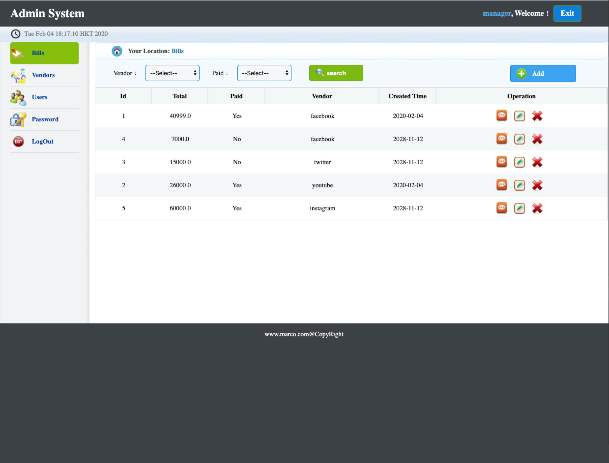

This project was bootstrapped with [SpringBoot initializer](https://github.com/facebook/create-react-app).

## Available Scripts

In the project root directory, you can run:

### `mvn springboot:run`

Runs the app in the development mode. 
Open [http://localhost:8080](http://localhost:8080) to view it in the browser.

The page will reload if you make edits in classpath. 

### `npm run build`

## Mapped Contents Local Directory

### `Find all Bills available` 

http://localhost:8080/bills 

### `Find Bill By id` 

http://localhost:8080/getBillById/{id} 

### `Delete Bill By id` 

http://localhost:8080/deleteBill/{id} 

### `Update Bill By id` 

http://localhost:8080/updateBill 

### `add Bill` 

http://localhost:8080/saveBill 